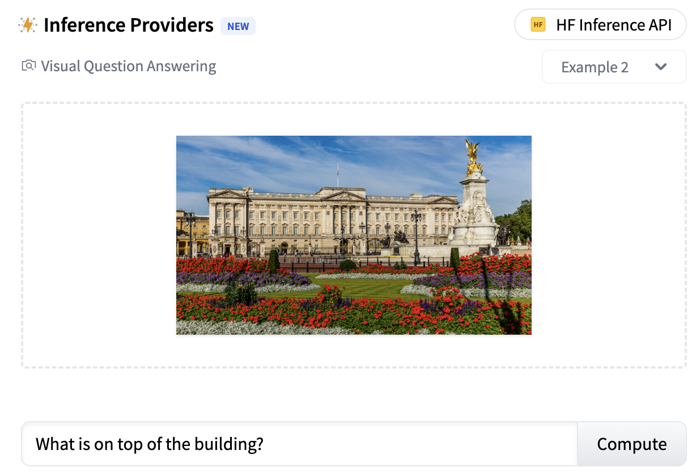
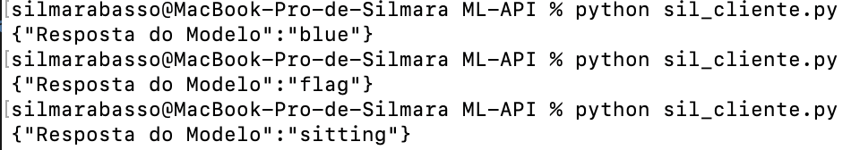

# Data API

The purpose of this repository is the construction, implementation and consumption of Data API for Machine Learning. I'm using the pre-trained Hunggind face Vision-and-Language Transformer (ViLT) model, fine-tuned on VQAv2

## Intended uses & limitations
You can use the raw model for visual question answering.

## Example 

# Perguntas

### 'Which color is the car in the image?'

### 'What is in the top of the building?'

###'What is the dog doing in the image?'

# Respostas

